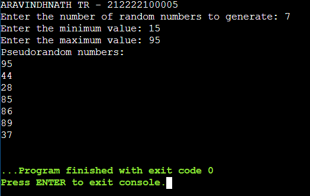

# EX-NO-6-Pseudo-Random-Number

# AIM: 

Implementation of Pseudorandom Number Generation Using Standard library

# ALGORITHM:

## 1.Start the program and import the required libraries.
## 2.Seed the random number generator using the current time (i.e) rand(time(0));
## 3.Get the number of random numbers to generate.
## 4.Pass the value for number of iterations and print the numbers.
## 5.End the program.

# PROGRAM:
```c
#include <stdio.h>

unsigned long seed = 123456789; 
unsigned long lcg() {
    const unsigned long a = 1664525; 
    const unsigned long c = 1013904223; 
    const unsigned long m = 4294967296; 

    seed = (a * seed + c) % m; 
    return seed; 
}

int main()
{
    int n; 
    unsigned long min, max;
    printf("ARAVINDHNATH TR - 212222100005\n"); 
    printf("Enter the number of random numbers to generate: ");
    scanf("%d", &n);
    printf("Enter the minimum value: ");
    scanf("%lu", &min);
    printf("Enter the maximum value: ");
    scanf("%lu", &max);

    if (min >= max) {
        printf("Error: Minimum value must be less than maximum value.\n");
        return 1;
    }

    printf("Pseudorandom numbers:\n");
    
    for (int i = 0; i < n; i++) {
        unsigned long random_number = lcg(); 
        unsigned long scaled_number = min + (random_number % (max - min + 1));
        printf("%lu\n", scaled_number);
    }
    
    return 0;
}
```
# OUTPUT:


# RESULT:
The Implementation of Pseudorandom Number Generation Using Standard library is successful.
